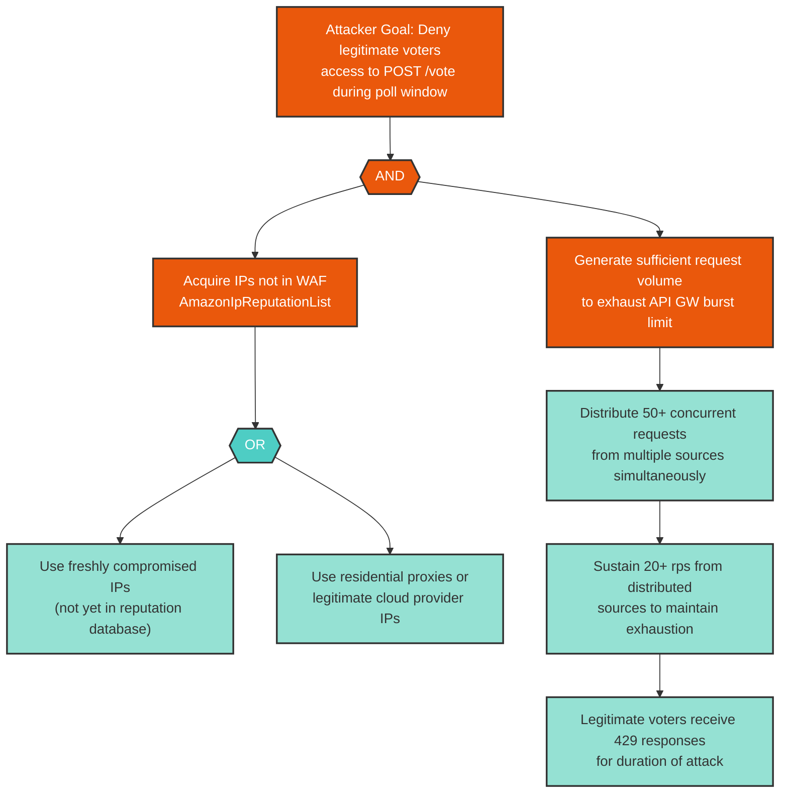

# D-4: API Gateway Burst Limit Exhaustion via Distributed Requests

```mermaid
flowchart TD
    D4_root["Attacker Goal: Deny legitimate voters\naccess to POST /vote during poll window"]
    D4_and1{{"AND"}}
    D4_sub1["Acquire IPs not in WAF\nAmazonIpReputationList"]
    D4_sub2["Generate sufficient request volume\nto exhaust API GW burst limit"]
    D4_or1{{"OR"}}
    D4_leaf1["Use freshly compromised IPs\n(not yet in reputation database)"]
    D4_leaf2["Use residential proxies or\nlegitimate cloud provider IPs"]
    D4_leaf3["Distribute 50+ concurrent requests\nfrom multiple sources simultaneously"]
    D4_leaf4["Sustain 20+ rps from distributed\nsources to maintain exhaustion"]
    D4_leaf5["Legitimate voters receive 429 responses\nfor duration of attack"]

    D4_root --> D4_and1
    D4_and1 --> D4_sub1
    D4_and1 --> D4_sub2
    D4_sub1 --> D4_or1
    D4_or1 --> D4_leaf1
    D4_or1 --> D4_leaf2
    D4_sub2 --> D4_leaf3
    D4_leaf3 --> D4_leaf4
    D4_leaf4 --> D4_leaf5

    classDef goal fill:#EA580C,stroke:#333,stroke-width:2px,color:#fff
    classDef andGate fill:#EA580C,stroke:#333,stroke-width:2px,color:#fff
    classDef orGate fill:#4ecdc4,stroke:#333,stroke-width:2px,color:#fff
    classDef leaf fill:#95e1d3,stroke:#333,stroke-width:2px,color:#333

    class D4_root goal
    class D4_and1,D4_sub1,D4_sub2 andGate
    class D4_or1 orGate
    class D4_leaf1,D4_leaf2,D4_leaf3,D4_leaf4,D4_leaf5 leaf
```
