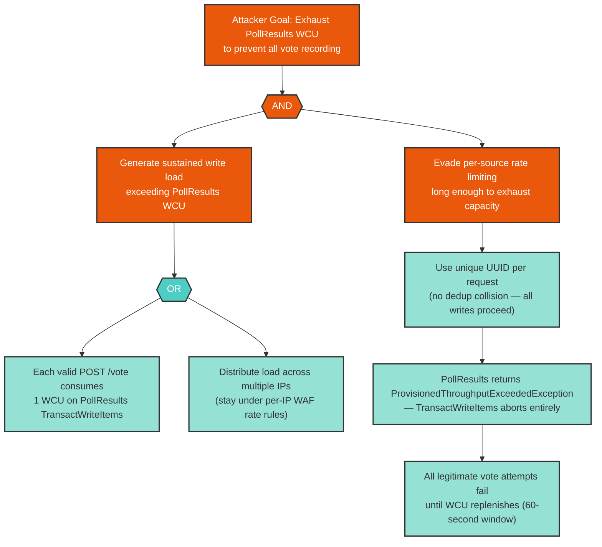

# D-7: DynamoDB PollResults Write Capacity Exhaustion via Vote Flooding

```mermaid
flowchart TD
    D7_root["Attacker Goal: Exhaust PollResults WCU\nto prevent all vote recording"]
    D7_and1{{"AND"}}
    D7_sub1["Generate sustained write load\nexceeding PollResults WCU"]
    D7_sub2["Evade per-source rate limiting\nlong enough to exhaust capacity"]
    D7_or1{{"OR"}}
    D7_leaf1["Each valid POST /vote consumes\n1 WCU on PollResults TransactWriteItems"]
    D7_leaf2["Distribute load across multiple IPs\n(stay under per-IP WAF rate rules)"]
    D7_leaf3["Use unique UUID per request\n(no dedup collision — all writes proceed)"]
    D7_leaf4["PollResults returns ProvisionedThroughputExceededException\n— TransactWriteItems aborts entirely"]
    D7_leaf5["All legitimate vote attempts fail\nuntil WCU replenishes (60-second window)"]

    D7_root --> D7_and1
    D7_and1 --> D7_sub1
    D7_and1 --> D7_sub2
    D7_sub1 --> D7_or1
    D7_or1 --> D7_leaf1
    D7_or1 --> D7_leaf2
    D7_sub2 --> D7_leaf3
    D7_leaf3 --> D7_leaf4
    D7_leaf4 --> D7_leaf5

    classDef goal fill:#EA580C,stroke:#333,stroke-width:2px,color:#fff
    classDef andGate fill:#EA580C,stroke:#333,stroke-width:2px,color:#fff
    classDef orGate fill:#4ecdc4,stroke:#333,stroke-width:2px,color:#fff
    classDef leaf fill:#95e1d3,stroke:#333,stroke-width:2px,color:#333

    class D7_root goal
    class D7_and1,D7_sub1,D7_sub2 andGate
    class D7_or1 orGate
    class D7_leaf1,D7_leaf2,D7_leaf3,D7_leaf4,D7_leaf5 leaf
```
