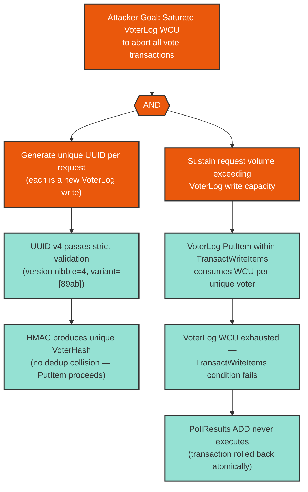

# D-8: VoterLog Write Saturation via Unique-UUID Flooding

```mermaid
flowchart TD
    D8_root["Attacker Goal: Saturate VoterLog WCU\nto abort all vote transactions"]
    D8_and1{{"AND"}}
    D8_sub1["Generate unique UUID per request\n(each is a new VoterLog write)"]
    D8_sub2["Sustain request volume exceeding\nVoterLog write capacity"]
    D8_leaf1["UUID v4 passes strict validation\n(version nibble=4, variant=[89ab])"]
    D8_leaf2["HMAC produces unique VoterHash\n(no dedup collision — PutItem proceeds)"]
    D8_leaf3["VoterLog PutItem within TransactWriteItems\nconsumes WCU per unique voter"]
    D8_leaf4["VoterLog WCU exhausted —\nTransactWriteItems condition fails"]
    D8_leaf5["PollResults ADD never executes\n(transaction rolled back atomically)"]

    D8_root --> D8_and1
    D8_and1 --> D8_sub1
    D8_and1 --> D8_sub2
    D8_sub1 --> D8_leaf1
    D8_leaf1 --> D8_leaf2
    D8_sub2 --> D8_leaf3
    D8_leaf3 --> D8_leaf4
    D8_leaf4 --> D8_leaf5

    classDef goal fill:#EA580C,stroke:#333,stroke-width:2px,color:#fff
    classDef andGate fill:#EA580C,stroke:#333,stroke-width:2px,color:#fff
    classDef orGate fill:#4ecdc4,stroke:#333,stroke-width:2px,color:#fff
    classDef leaf fill:#95e1d3,stroke:#333,stroke-width:2px,color:#333

    class D8_root goal
    class D8_and1,D8_sub1,D8_sub2 andGate
    class D8_leaf1,D8_leaf2,D8_leaf3,D8_leaf4,D8_leaf5 leaf
```
