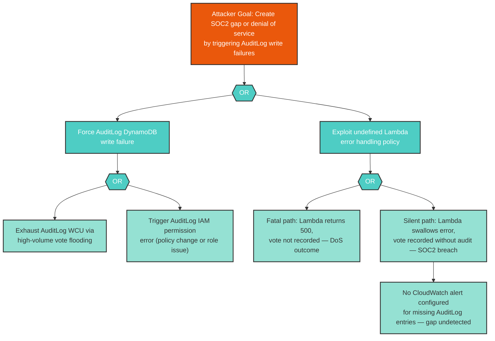

# D-9: AuditLog Write Failure Cascading to Vote Processing Failure or SOC2 Compliance Breach

```mermaid
flowchart TD
    D9_root["Attacker Goal: Create SOC2 gap or denial of service\nby triggering AuditLog write failures"]
    D9_or1{{"OR"}}
    D9_sub1["Force AuditLog DynamoDB\nwrite failure"]
    D9_sub2["Exploit undefined Lambda\nerror handling policy"]
    D9_or2{{"OR"}}
    D9_or3{{"OR"}}
    D9_leaf1["Exhaust AuditLog WCU via\nhigh-volume vote flooding"]
    D9_leaf2["Trigger AuditLog IAM permission\nerror (policy change or role issue)"]
    D9_leaf3["Fatal path: Lambda returns 500,\nvote not recorded — DoS outcome"]
    D9_leaf4["Silent path: Lambda swallows error,\nvote recorded without audit — SOC2 breach"]
    D9_leaf5["No CloudWatch alert configured\nfor missing AuditLog entries — gap undetected"]

    D9_root --> D9_or1
    D9_or1 --> D9_sub1
    D9_or1 --> D9_sub2
    D9_sub1 --> D9_or2
    D9_or2 --> D9_leaf1
    D9_or2 --> D9_leaf2
    D9_sub2 --> D9_or3
    D9_or3 --> D9_leaf3
    D9_or3 --> D9_leaf4
    D9_leaf4 --> D9_leaf5

    classDef goal fill:#EA580C,stroke:#333,stroke-width:2px,color:#fff
    classDef andGate fill:#EA580C,stroke:#333,stroke-width:2px,color:#fff
    classDef orGate fill:#4ecdc4,stroke:#333,stroke-width:2px,color:#fff
    classDef leaf fill:#95e1d3,stroke:#333,stroke-width:2px,color:#333

    class D9_root goal
    class D9_or1,D9_sub1,D9_sub2 orGate
    class D9_or2,D9_or3 orGate
    class D9_leaf1,D9_leaf2,D9_leaf3,D9_leaf4,D9_leaf5 leaf
```
