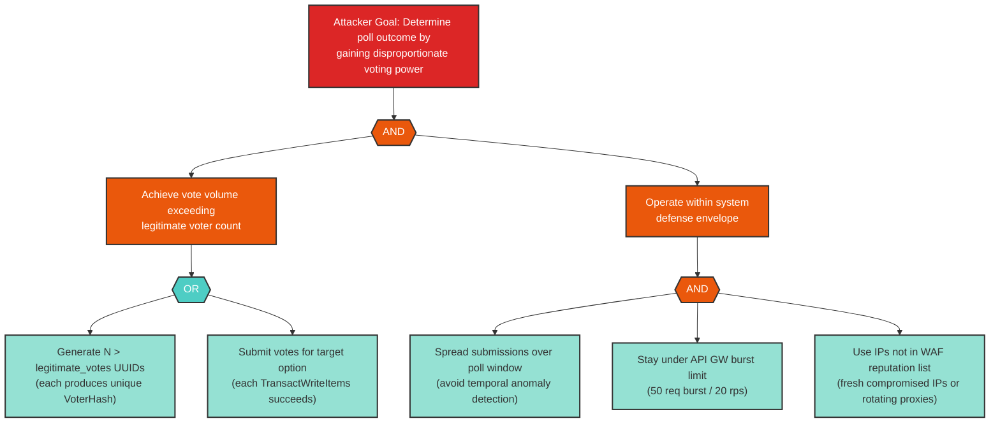

# E-4: Sybil Privilege Elevation Enabling Poll Outcome Determination

```mermaid
flowchart TD
    E4_root["Attacker Goal: Determine poll outcome by\ngaining disproportionate voting power"]
    E4_and1{{"AND"}}
    E4_sub1["Achieve vote volume exceeding\nlegitimate voter count"]
    E4_sub2["Operate within system\ndefense envelope"]
    E4_or1{{"OR"}}
    E4_and2{{"AND"}}
    E4_leaf1["Generate N > legitimate_votes UUIDs\n(each produces unique VoterHash)"]
    E4_leaf2["Submit votes for target option\n(each TransactWriteItems succeeds)"]
    E4_leaf3["Spread submissions over poll window\n(avoid temporal anomaly detection)"]
    E4_leaf4["Stay under API GW burst limit\n(50 req burst / 20 rps)"]
    E4_leaf5["Use IPs not in WAF reputation list\n(fresh compromised IPs or rotating proxies)"]

    E4_root --> E4_and1
    E4_and1 --> E4_sub1
    E4_and1 --> E4_sub2
    E4_sub1 --> E4_or1
    E4_or1 --> E4_leaf1
    E4_or1 --> E4_leaf2
    E4_sub2 --> E4_and2
    E4_and2 --> E4_leaf3
    E4_and2 --> E4_leaf4
    E4_and2 --> E4_leaf5

    classDef goal fill:#DC2626,stroke:#333,stroke-width:2px,color:#fff
    classDef andGate fill:#EA580C,stroke:#333,stroke-width:2px,color:#fff
    classDef orGate fill:#4ecdc4,stroke:#333,stroke-width:2px,color:#fff
    classDef leaf fill:#95e1d3,stroke:#333,stroke-width:2px,color:#333

    class E4_root goal
    class E4_and1,E4_and2 andGate
    class E4_sub1,E4_sub2 andGate
    class E4_or1 orGate
    class E4_leaf1,E4_leaf2,E4_leaf3,E4_leaf4,E4_leaf5 leaf
```
