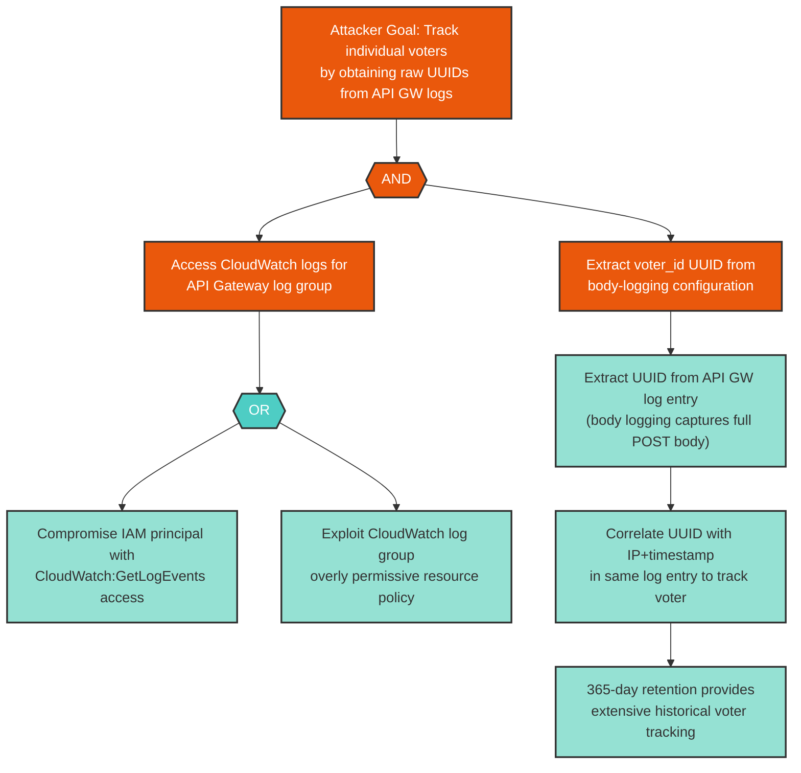

# I-4: API Gateway Access Logs Capture voter_id UUID Breaking GDPR Pseudonymisation

```mermaid
flowchart TD
    I4_root["Attacker Goal: Track individual voters\nby obtaining raw UUIDs from API GW logs"]
    I4_and1{{"AND"}}
    I4_sub1["Access CloudWatch logs for\nAPI Gateway log group"]
    I4_sub2["Extract voter_id UUID from\nbody-logging configuration"]
    I4_or1{{"OR"}}
    I4_leaf1["Compromise IAM principal with\nCloudWatch:GetLogEvents access"]
    I4_leaf2["Exploit CloudWatch log group\noverly permissive resource policy"]
    I4_leaf3["Extract UUID from API GW log entry\n(body logging captures full POST body)"]
    I4_leaf4["Correlate UUID with IP+timestamp\nin same log entry to track voter"]
    I4_leaf5["365-day retention provides\nextensive historical voter tracking"]

    I4_root --> I4_and1
    I4_and1 --> I4_sub1
    I4_and1 --> I4_sub2
    I4_sub1 --> I4_or1
    I4_or1 --> I4_leaf1
    I4_or1 --> I4_leaf2
    I4_sub2 --> I4_leaf3
    I4_leaf3 --> I4_leaf4
    I4_leaf4 --> I4_leaf5

    classDef goal fill:#EA580C,stroke:#333,stroke-width:2px,color:#fff
    classDef andGate fill:#EA580C,stroke:#333,stroke-width:2px,color:#fff
    classDef orGate fill:#4ecdc4,stroke:#333,stroke-width:2px,color:#fff
    classDef leaf fill:#95e1d3,stroke:#333,stroke-width:2px,color:#333

    class I4_root goal
    class I4_and1,I4_sub1,I4_sub2 andGate
    class I4_or1 orGate
    class I4_leaf1,I4_leaf2,I4_leaf3,I4_leaf4,I4_leaf5 leaf
```
