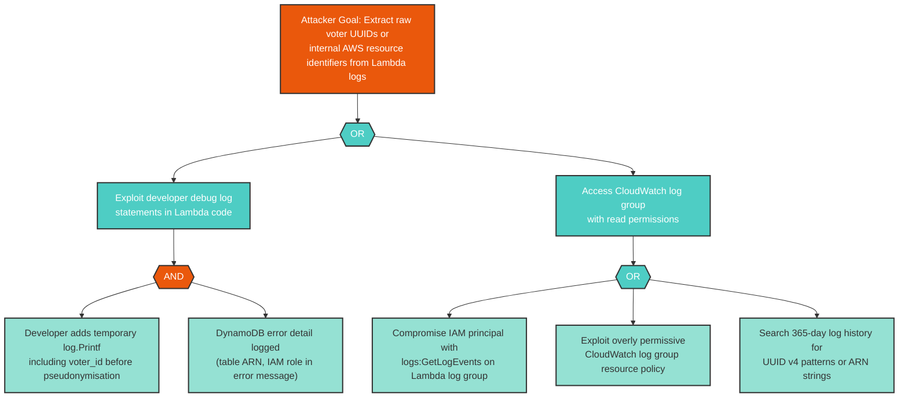

# I-5: Lambda Structured Log Over-Logging Exposes Raw UUIDs or Internal Resource Identifiers

```mermaid
flowchart TD
    I5_root["Attacker Goal: Extract raw voter UUIDs or\ninternal AWS resource identifiers from Lambda logs"]
    I5_or1{{"OR"}}
    I5_sub1["Exploit developer debug log\nstatements in Lambda code"]
    I5_sub2["Access CloudWatch log group\nwith read permissions"]
    I5_and1{{"AND"}}
    I5_or2{{"OR"}}
    I5_leaf1["Developer adds temporary log.Printf\nincluding voter_id before pseudonymisation"]
    I5_leaf2["DynamoDB error detail logged\n(table ARN, IAM role in error message)"]
    I5_leaf3["Compromise IAM principal with\nlogs:GetLogEvents on Lambda log group"]
    I5_leaf4["Exploit overly permissive\nCloudWatch log group resource policy"]
    I5_leaf5["Search 365-day log history for\nUUID v4 patterns or ARN strings"]

    I5_root --> I5_or1
    I5_or1 --> I5_sub1
    I5_or1 --> I5_sub2
    I5_sub1 --> I5_and1
    I5_and1 --> I5_leaf1
    I5_and1 --> I5_leaf2
    I5_sub2 --> I5_or2
    I5_or2 --> I5_leaf3
    I5_or2 --> I5_leaf4
    I5_or2 --> I5_leaf5

    classDef goal fill:#EA580C,stroke:#333,stroke-width:2px,color:#fff
    classDef andGate fill:#EA580C,stroke:#333,stroke-width:2px,color:#fff
    classDef orGate fill:#4ecdc4,stroke:#333,stroke-width:2px,color:#fff
    classDef leaf fill:#95e1d3,stroke:#333,stroke-width:2px,color:#333

    class I5_root goal
    class I5_and1 andGate
    class I5_or1,I5_sub1,I5_sub2 orGate
    class I5_or2 orGate
    class I5_leaf1,I5_leaf2,I5_leaf3,I5_leaf4,I5_leaf5 leaf
```
