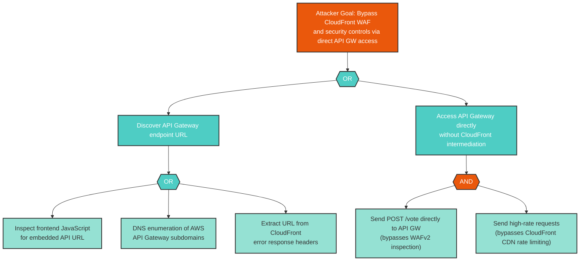

# S-4: Direct-to-Origin Bypass of CloudFront Security Controls

```mermaid
flowchart TD
    S4_root["Attacker Goal: Bypass CloudFront WAF\nand security controls via direct API GW access"]
    S4_or1{{"OR"}}
    S4_sub1["Discover API Gateway endpoint URL"]
    S4_sub2["Access API Gateway directly\nwithout CloudFront intermediation"]
    S4_or2{{"OR"}}
    S4_and1{{"AND"}}
    S4_leaf1["Inspect frontend JavaScript\nfor embedded API URL"]
    S4_leaf2["DNS enumeration of AWS\nAPI Gateway subdomains"]
    S4_leaf3["Extract URL from CloudFront\nerror response headers"]
    S4_leaf4["Send POST /vote directly to API GW\n(bypasses WAFv2 inspection)"]
    S4_leaf5["Send high-rate requests\n(bypasses CloudFront CDN rate limiting)"]

    S4_root --> S4_or1
    S4_or1 --> S4_sub1
    S4_or1 --> S4_sub2
    S4_sub1 --> S4_or2
    S4_or2 --> S4_leaf1
    S4_or2 --> S4_leaf2
    S4_or2 --> S4_leaf3
    S4_sub2 --> S4_and1
    S4_and1 --> S4_leaf4
    S4_and1 --> S4_leaf5

    classDef goal fill:#EA580C,stroke:#333,stroke-width:2px,color:#fff
    classDef andGate fill:#EA580C,stroke:#333,stroke-width:2px,color:#fff
    classDef orGate fill:#4ecdc4,stroke:#333,stroke-width:2px,color:#fff
    classDef leaf fill:#95e1d3,stroke:#333,stroke-width:2px,color:#333

    class S4_root goal
    class S4_and1 andGate
    class S4_or1,S4_sub1,S4_sub2 orGate
    class S4_or2 orGate
    class S4_leaf1,S4_leaf2,S4_leaf3,S4_leaf4,S4_leaf5 leaf
```
