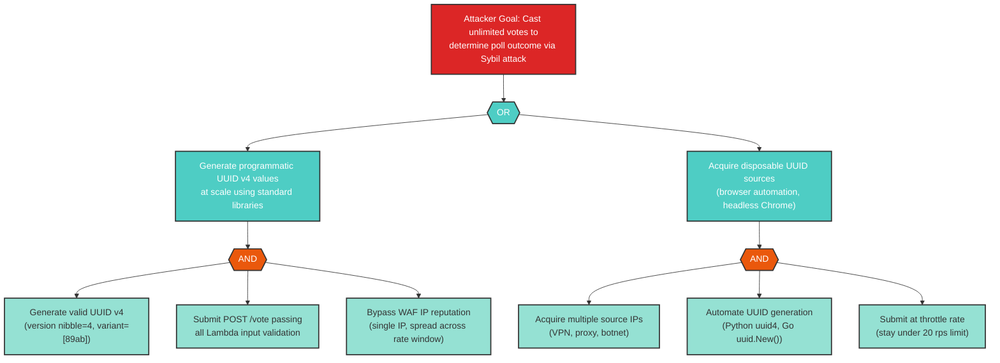

# S-6: Sybil Attack via Programmatic UUID Generation

```mermaid
flowchart TD
    S6_root["Attacker Goal: Cast unlimited votes to\ndetermine poll outcome via Sybil attack"]
    S6_or1{{"OR"}}
    S6_sub1["Generate programmatic UUID v4 values\nat scale using standard libraries"]
    S6_sub2["Acquire disposable UUID sources\n(browser automation, headless Chrome)"]
    S6_and1{{"AND"}}
    S6_and2{{"AND"}}
    S6_leaf1["Generate valid UUID v4\n(version nibble=4, variant=[89ab])"]
    S6_leaf2["Submit POST /vote passing\nall Lambda input validation"]
    S6_leaf3["Bypass WAF IP reputation\n(single IP, spread across rate window)"]
    S6_leaf4["Acquire multiple source IPs\n(VPN, proxy, botnet)"]
    S6_leaf5["Automate UUID generation\n(Python uuid4, Go uuid.New())"]
    S6_leaf6["Submit at throttle rate\n(stay under 20 rps limit)"]

    S6_root --> S6_or1
    S6_or1 --> S6_sub1
    S6_or1 --> S6_sub2
    S6_sub1 --> S6_and1
    S6_and1 --> S6_leaf1
    S6_and1 --> S6_leaf2
    S6_and1 --> S6_leaf3
    S6_sub2 --> S6_and2
    S6_and2 --> S6_leaf4
    S6_and2 --> S6_leaf5
    S6_and2 --> S6_leaf6

    classDef goal fill:#DC2626,stroke:#333,stroke-width:2px,color:#fff
    classDef andGate fill:#EA580C,stroke:#333,stroke-width:2px,color:#fff
    classDef orGate fill:#4ecdc4,stroke:#333,stroke-width:2px,color:#fff
    classDef leaf fill:#95e1d3,stroke:#333,stroke-width:2px,color:#333

    class S6_root goal
    class S6_or1 orGate
    class S6_sub1,S6_sub2 orGate
    class S6_and1,S6_and2 andGate
    class S6_leaf1,S6_leaf2,S6_leaf3,S6_leaf4,S6_leaf5,S6_leaf6 leaf
```
