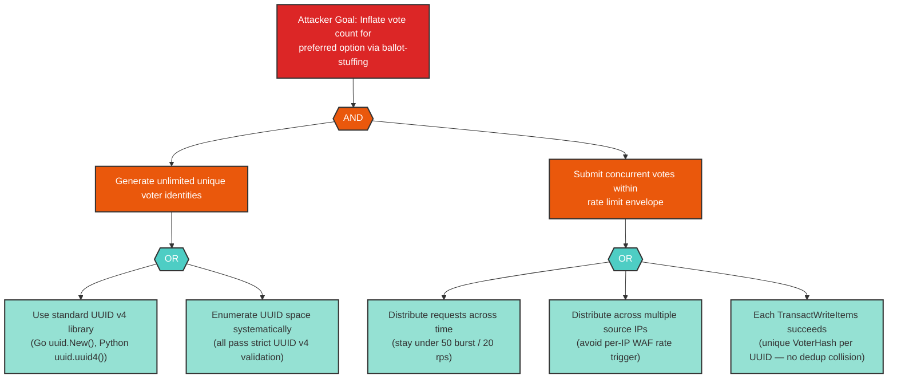

# T-5: Systematic Ballot-Stuffing via Multi-Identity Concurrent Vote Submission

```mermaid
flowchart TD
    T5_root["Attacker Goal: Inflate vote count for\npreferred option via ballot-stuffing"]
    T5_and1{{"AND"}}
    T5_sub1["Generate unlimited unique voter identities"]
    T5_sub2["Submit concurrent votes within\nrate limit envelope"]
    T5_or1{{"OR"}}
    T5_or2{{"OR"}}
    T5_leaf1["Use standard UUID v4 library\n(Go uuid.New(), Python uuid.uuid4())"]
    T5_leaf2["Enumerate UUID space systematically\n(all pass strict UUID v4 validation)"]
    T5_leaf3["Distribute requests across time\n(stay under 50 burst / 20 rps)"]
    T5_leaf4["Distribute across multiple source IPs\n(avoid per-IP WAF rate trigger)"]
    T5_leaf5["Each TransactWriteItems succeeds\n(unique VoterHash per UUID — no dedup collision)"]

    T5_root --> T5_and1
    T5_and1 --> T5_sub1
    T5_and1 --> T5_sub2
    T5_sub1 --> T5_or1
    T5_or1 --> T5_leaf1
    T5_or1 --> T5_leaf2
    T5_sub2 --> T5_or2
    T5_or2 --> T5_leaf3
    T5_or2 --> T5_leaf4
    T5_or2 --> T5_leaf5

    classDef goal fill:#DC2626,stroke:#333,stroke-width:2px,color:#fff
    classDef andGate fill:#EA580C,stroke:#333,stroke-width:2px,color:#fff
    classDef orGate fill:#4ecdc4,stroke:#333,stroke-width:2px,color:#fff
    classDef leaf fill:#95e1d3,stroke:#333,stroke-width:2px,color:#333

    class T5_root goal
    class T5_and1 andGate
    class T5_sub1,T5_sub2 andGate
    class T5_or1,T5_or2 orGate
    class T5_leaf1,T5_leaf2,T5_leaf3,T5_leaf4,T5_leaf5 leaf
```
