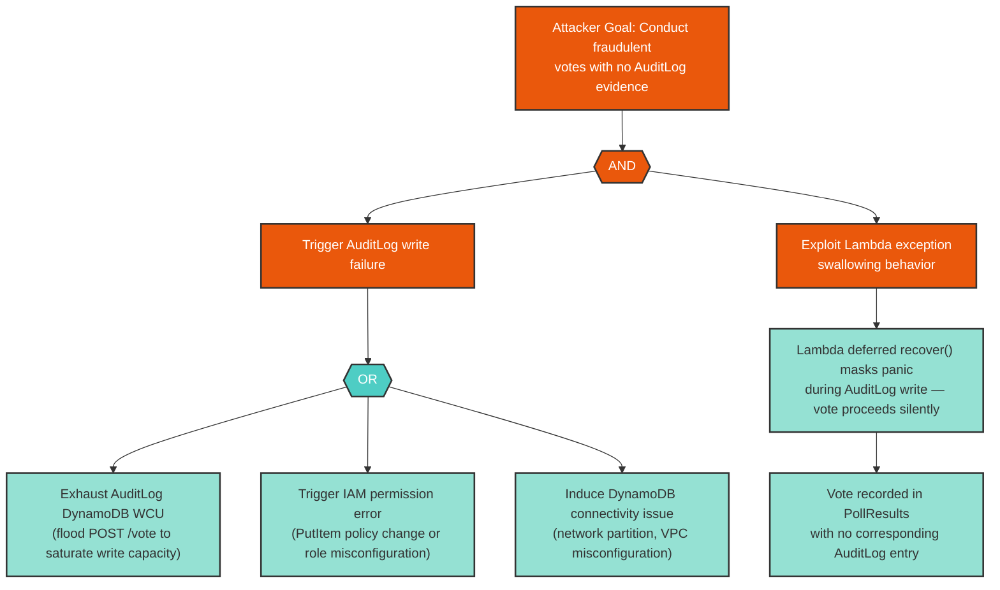

# T-9: AuditLog Write Suppression via Exception Swallowing Breaks SOC2 Auditability

```mermaid
flowchart TD
    T9_root["Attacker Goal: Conduct fraudulent\nvotes with no AuditLog evidence"]
    T9_and1{{"AND"}}
    T9_sub1["Trigger AuditLog write failure"]
    T9_sub2["Exploit Lambda exception\nswallowing behavior"]
    T9_or1{{"OR"}}
    T9_leaf1["Exhaust AuditLog DynamoDB WCU\n(flood POST /vote to saturate write capacity)"]
    T9_leaf2["Trigger IAM permission error\n(PutItem policy change or role misconfiguration)"]
    T9_leaf3["Induce DynamoDB connectivity issue\n(network partition, VPC misconfiguration)"]
    T9_leaf4["Lambda deferred recover() masks panic\nduring AuditLog write — vote proceeds silently"]
    T9_leaf5["Vote recorded in PollResults\nwith no corresponding AuditLog entry"]

    T9_root --> T9_and1
    T9_and1 --> T9_sub1
    T9_and1 --> T9_sub2
    T9_sub1 --> T9_or1
    T9_or1 --> T9_leaf1
    T9_or1 --> T9_leaf2
    T9_or1 --> T9_leaf3
    T9_sub2 --> T9_leaf4
    T9_leaf4 --> T9_leaf5

    classDef goal fill:#EA580C,stroke:#333,stroke-width:2px,color:#fff
    classDef andGate fill:#EA580C,stroke:#333,stroke-width:2px,color:#fff
    classDef orGate fill:#4ecdc4,stroke:#333,stroke-width:2px,color:#fff
    classDef leaf fill:#95e1d3,stroke:#333,stroke-width:2px,color:#333

    class T9_root goal
    class T9_and1,T9_sub1,T9_sub2 andGate
    class T9_or1 orGate
    class T9_leaf1,T9_leaf2,T9_leaf3,T9_leaf4,T9_leaf5 leaf
```
