# Vote-on-It — Threat Report

## 1. Executive Summary

Vote-on-It presents a **moderate-to-high overall security posture** for its infrastructure layer but carries **critical-severity gaps in Sybil resistance** that fundamentally threaten poll integrity. Three critical findings indicate that the core purpose of the application — fair polling — can be undermined by any technically capable attacker using freely available tools.

**Top threats ranked by business impact:**

1. **Sybil ballot-stuffing (S-6, T-5, E-4 — Critical)**: An attacker can generate unlimited valid voter identities using standard UUID libraries and vote multiple times, systematically determining poll outcomes. There is no per-IP vote rate limit, no CAPTCHA, and no Sybil detection. This is the highest-priority risk because it directly undermines the application's core purpose.

2. **GDPR pseudonymisation breach via logging (I-4, I-5 — High)**: Raw voter UUIDs may be captured in API Gateway access logs or Lambda debug logs, breaking the pseudonymisation guarantee required under GDPR Article 4(5) and creating 365-day retention of linkable voter data.

3. **SOC2 audit trail corruption (T-9, D-9 — High)**: The AuditLog write error handling policy is undefined. If Lambda swallows AuditLog failures, votes proceed without SOC2-required audit records. If failures are treated as fatal, a DynamoDB capacity event shuts down voting entirely. Neither outcome is acceptable.

4. **DynamoDB availability under load (D-7, D-8 — High)**: Both PollResults and VoterLog are susceptible to write capacity exhaustion under sustained flooding — an attack vector that is significantly easier than compromising WAF protections because the attacker operates within the defined API contract using valid UUIDs.

5. **Direct-to-origin API Gateway bypass (S-4 — High)**: The API Gateway URL is discoverable, and there is no mechanism preventing direct access that bypasses CloudFront's WAF inspection, HSTS enforcement, and CDN-layer rate limiting.

**What is working well**: The infrastructure security layer is genuinely strong. TLS 1.3 enforcement, HSTS preloading, OAC sigv4 S3 access, KMS encryption at rest for all DynamoDB tables and Secrets Manager, IAM least-privilege (PutItem-only on AuditLog, restricted GetSecretValue), the ACID TransactWriteItems dedup design, strict UUID v4 validation, and the 512-byte body limit are all correctly implemented. The GDPR HMAC pseudonymisation design is architecturally sound.

**Key recommendations** (outcomes, not methods):
- Deploy Sybil resistance controls before production launch — per-IP rate limiting, Bot Control, and vote anomaly detection are prerequisites, not nice-to-haves.
- Define and test the AuditLog failure handling policy explicitly before go-live.
- Audit and lock down all CloudWatch log group access policies to prevent GDPR data leakage via log retention.

**Compliance relevance**: SOC2 CC6.1 (logical access), CC7.2 (system monitoring), and CC4.1 (risk assessment) are directly implicated by T-9 and D-9. GDPR Articles 4(5), 17, and 25 (data protection by design) are implicated by I-4, I-5, I-6, and I-8.

**Remediation timeline**:
- **Immediate (before any production launch)**: S-6, T-5, E-4 (Sybil resistance), T-9 (AuditLog error policy), D-9 (AuditLog availability)
- **Short-term (current development cycle)**: S-4 (API GW origin protection), I-4 (API GW log PII control), I-5 (Lambda log PII control), D-4 (DDoS resilience), D-7, D-8 (DynamoDB capacity)
- **Medium-term (upcoming planning cycle)**: I-2, I-6, I-9, R-2, R-4, R-5, T-2 through T-7, E-1, E-3 (hardening and observability improvements)
- **Backlog**: Note and Low findings (operational hygiene, residual risk)

---

## 2. Architecture Overview

### System Context

Vote-on-It is a serverless polling application hosted entirely on AWS in the eu-central-1 (Frankfurt) region, selected for GDPR data residency compliance. Users visit a CloudFront-delivered web application, see a single poll question with four answer options, and click to cast a vote. The vote is processed by a Go Lambda function and the result is shown immediately as a live bar chart.

The system is designed around three core security properties: (1) GDPR-compliant pseudonymisation of voter identities, (2) SOC2 auditability of every state change, and (3) prevention of duplicate votes. Voter identity is represented by a UUID v4 generated in the browser and stored in localStorage. This UUID is never stored raw on the server — it is immediately transformed into an HMAC-SHA256 hash using a secret salt from Secrets Manager, and only the hash is recorded in the deduplication table (VoterLog).

The backend consists of a single Go Lambda function serving two HTTP routes (POST /vote and GET /results) via API Gateway v2. Three DynamoDB tables store poll results (PollResults), voter deduplication records (VoterLog), and the immutable SOC2 audit trail (AuditLog). Static assets are served from a private S3 bucket, accessible only through CloudFront using Origin Access Control with SigV4 signing.

The system processes personally-pseudonymised voter data and is subject to GDPR Article 4(5) pseudonymisation requirements, SOC2 auditability requirements for all state changes, and 24-hour data retention limits for voter deduplication records. These compliance constraints are reflected in the architecture's encryption-at-rest design (KMS CMK on all DynamoDB tables and Secrets Manager), the AuditLog's PutItem-only IAM policy, and the VoterLog's TTL-based auto-deletion.

### Trust Boundary Summary

The architecture spans three distinct trust zones. The **Public Internet** zone contains only the User Browser — an untrusted external entity that the system has no control over. The **AWS Edge zone** (restricted to US and EU CloudFront nodes under PriceClass_100) contains the WAFv2 WebACL and CloudFront Distribution. This semi-trusted zone provides the first line of defense: WAF inspection blocks OWASP Top 10 payloads, Log4j/SSRF/Spring4Shell exploits, and known botnet IPs before any traffic reaches the AWS Cloud. CloudFront enforces HTTPS redirect, HSTS with preloading, strict CSP, X-Frame-Options DENY, and X-Content-Type-Options nosniff.

The **AWS Cloud zone** (eu-central-1) is the trusted zone containing all compute and data components: API Gateway v2, the Lambda execution environment, Secrets Manager, and the three DynamoDB tables. Traffic entering the AWS Cloud from the edge zone is already TLS-enforced, WAF-inspected, and CloudFront-authenticated via OAC sigv4. Within the cloud zone, all inter-service communication uses IAM least-privilege roles with no wildcard ARNs.

Three boundary crossings exist with explicit controls: the Browser-to-Edge crossing is protected by TLS 1.3, WAFv2 inspection, and HSTS; the Edge-to-S3 crossing uses SigV4 OAC with an ARN-specific bucket policy; and the Edge-to-API crossing uses TLS 1.3 with CORS restricted to the CloudFront domain only.

---

## 3. Threat Analysis

### 3.1 Spoofing

The spoofing threat landscape for Vote-on-It is dominated by a single critical-severity finding that represents the system's most significant security gap.

**S-6 (Critical)** is the most consequential finding in the entire threat model. The Go Lambda enforces strict UUID v4 validation — version nibble must be 4, variant in [89ab] — which is necessary but insufficient as a spoofing defense. Any attacker can generate valid UUID v4 values programmatically using `uuid.New()` in Go, `uuid.uuid4()` in Python, or equivalent in any language. Each generated UUID passes all Lambda validation checks, produces a unique VoterHash via HMAC, and successfully records a vote. There is no mechanism to limit how many UUIDs a single source can use — the API Gateway throttle of 20 rps limits the rate but not the total volume. An attacker can trivially cast thousands of votes over the course of a multi-hour polling window while remaining within the rate limit envelope.

**S-4 (High)** represents a meaningful security control bypass. CloudFront provides the WAF layer, HSTS enforcement, and CDN rate limiting. If an attacker can determine the API Gateway URL — discoverable from JavaScript inspection, CloudFront error responses, or DNS enumeration of the `vpgdluhxck.execute-api.eu-central-1.amazonaws.com` subdomain pattern — they can bypass all CloudFront controls entirely by sending requests directly to the API Gateway origin.

**S-1 (Medium)** covers UUID theft via localStorage. The Math.random UUID fallback (S-2, Note) represents a cryptographic quality gap on older browsers, though modern browser prevalence makes this a low-probability scenario in practice.

**S-3 (Medium)** and **S-5 (Low)** represent standard edge-case spoofing risks inherent to WAF and API Gateway deployments that are largely mitigated by the existing managed rule sets.

### 3.2 Tampering

The tampering category surfaces two critical operational risks alongside several infrastructure-level hardening gaps.

**T-5 (Critical)** is the tampering analog of S-6 — the same Sybil attack vector but framed as deliberate poll result manipulation. The TransactWriteItems design correctly prevents any single UUID from voting twice, but each new UUID is an independent voter from the system's perspective. The semantic integrity of the poll (that each human votes once) is not enforced — only the technical constraint (each UUID votes once) is enforced. This design limitation is fundamental to the current architecture and requires out-of-band controls (rate limiting, Bot Control, anomaly detection) rather than in-protocol fixes.

**T-9 (High)** identifies a critical SOC2 compliance risk. The Lambda code's deferred `recover()` is designed to catch panics and return controlled error responses — a sound design choice for availability. However, if a panic occurs during the AuditLog PutItem call, the recover() will mask the failure. The architecture does not specify whether a failed AuditLog write should abort the vote transaction (preserving SOC2 compliance at the cost of availability) or continue (preserving availability at the cost of SOC2 compliance). This ambiguity must be resolved before production deployment.

**T-2 (Medium)** and **T-3 (Medium)** address the S3 asset supply chain. S3 versioning and OAC provide good baseline controls, but CI/CD credential compromise remains a realistic threat given the frequency of developer workstation compromises and secrets leakage in CI/CD pipelines. The mitigation of shifting to OIDC-based IAM roles for CI/CD (eliminating long-lived access keys) is a standard practice that should be implemented before production.

**T-6 (Medium)** identifies a subtle correctness risk in the HMAC salt lifecycle. The AWS KMS annual key rotation (correctly configured) rotates the wrapping key for the secret but does not rotate the salt value itself. However, if an operator misunderstands this distinction and intentionally rotates the salt value (e.g., after a suspected compromise), the entire VoterLog dedup history becomes invalid, enabling all previous voters to vote again. This scenario requires explicit documentation and runbook controls.

**T-4 (Medium)**, **T-7 (Medium)**, and **T-8 (Low)** represent Terraform drift and IAM boundary risks — important infrastructure hygiene findings addressable through drift detection and hardening.

### 3.3 Repudiation

The repudiation category reveals observability and forensic logging gaps that could impact both SOC2 audit coverage and incident investigation capability.

**R-4 (Medium)** is the most operationally impactful repudiation finding. API Gateway v2 access logs are mentioned in the architecture but the specific log format (the `$context.*` variable mapping) is not specified. AWS API Gateway v2 defaults to a minimal log format that often omits critical forensic fields. Without `$context.requestTime`, `$context.requestId`, `$context.identity.sourceIp`, and `$context.status`, the logs may not meet SOC2 CC7.2 evidence requirements for audit attribution.

**R-5 (Medium)** surfaces the Lambda multi-instance log correlation challenge. When Lambda scales to multiple concurrent instances, each writes to a separate CloudWatch log stream. Without a correlation ID (e.g., the API Gateway requestId) propagated through all Lambda log entries, reconstructing a specific voter's transaction timeline requires manual cross-stream searching — a significant operational burden during incidents.

**R-2 (Medium)** addresses the WAF sampling gap. WAF rules in sampled mode provide metrics and alerting but do not produce complete forensic records. For SOC2 CC4.1 (risk assessment), a comprehensive record of security events at the WAF layer is important evidence.

**R-1 (Low)** and **R-3 (Note)** represent residual repudiation risks inherent to the pseudonymised, non-session-based design.

### 3.4 Information Disclosure

The information disclosure category contains the most GDPR-sensitive findings in the threat model, with two High-severity findings that represent direct compliance risks.

**I-4 (High)** is the highest-priority GDPR finding. API Gateway v2 access logging is enabled with KMS encryption and 365-day retention — both correct choices. However, if the log format includes request body content (a common configuration mistake, often done during debugging and forgotten), the raw voter_id UUID appears in plaintext alongside the source IP and exact timestamp. This directly violates GDPR Article 4(5) pseudonymisation: the UUID is re-linkable to the voter through the combination of IP + timestamp + UUID in a single log record. The 365-day retention period means any such exposure has extended duration.

**I-5 (High)** covers the developer debug log risk. The Lambda code correctly logs VoterHash[:8] as actor_id and never logs raw UUIDs in the production code path. However, a developer adding a temporary `log.Printf("voter_id: %s", event.Body.VoterID)` during debugging — a near-universal practice — would expose the raw UUID in CloudWatch for up to 365 days. The absence of automated PII scanning in the log pipeline creates a persistent risk of accidental GDPR violations.

**I-6 (Medium)** identifies the HMAC salt as the single point of failure for GDPR pseudonymisation. If the salt is exposed (via debug endpoints, memory inspection, or code compromise), all VoterHash values become pre-computable, retroactively de-pseudonymising the entire voter database. This is a catastrophic-if-triggered risk that justifies the existing Secrets Manager controls — but the mitigation section notes that the runbook for salt compromise (invalidating VoterLog, re-issuing salt) is not explicitly defined.

**I-2 (Medium)**, **I-7 (Medium)**, **I-8 (Medium)**, and **I-9 (Medium)** represent secondary information disclosure risks involving infrastructure metadata exposure, real-time trend disclosure, voter status enumeration (contingent on salt compromise), and AuditLog ActorID pattern analysis.

**I-1 (Note)**, **I-3 (Note)** are low-impact residual risks.

### 3.5 Denial of Service

The denial of service category reveals a concerning pattern: the primary availability protections (WAF IP reputation, API Gateway throttle) are effective against unsophisticated attacks but vulnerable to distributed attacks using fresh IPs and legitimate-looking traffic patterns.

**D-4 (High)** is the most direct availability threat. The API Gateway throttle of 50 burst/20 rps is a reasonable default but provides limited protection against distributed attacks from IPs not in the WAF AmazonIpReputationList. Fresh compromised IPs (residential botnets, cloud provider IPs) commonly evade reputation-based blocking. A coordinated attack from 10 sources at 5 rps each would exhaust the sustained limit completely while each source individually remains under a hypothetical per-IP rate rule.

**D-7 (High)** and **D-8 (High)** represent a more fundamental availability risk: DynamoDB write capacity exhaustion. If either PollResults or VoterLog runs out of WCU (under provisioned capacity mode), the TransactWriteItems that wraps both writes fails, aborting the entire vote transaction. The attacker's advantage here is that each request that passes WAF and API Gateway throttling directly translates to DynamoDB writes — there is no in-Lambda defense against WCU exhaustion. The recommended mitigation (DynamoDB on-demand capacity mode) eliminates this specific attack vector.

**D-9 (High)** closes the loop between the AuditLog error handling ambiguity (T-9) and availability. Whether the error handling policy is "fatal" or "silent," a DynamoDB WCU exhaustion event on AuditLog triggers either a complete vote processing shutdown or a SOC2 breach.

**D-6 (Medium)** identifies the Secrets Manager cold-start dependency as a scaling bottleneck. The existing memory caching design significantly reduces this risk in practice — only cold-start Lambda instances call GetSecretValue, and warm instances reuse the cached value. However, during a sudden scaling event with many simultaneous cold-starts, the risk is real.

**D-1 through D-3 (Low)** and **D-5 (Low)** represent well-mitigated or inherently bounded risks.

### 3.6 Elevation of Privilege

The elevation of privilege category is dominated by the Sybil attack vector (E-4) and several infrastructure-boundary findings.

**E-4 (Critical)** reframes S-6 and T-5 in privilege terms. A legitimate voter has the privilege of casting one vote. An attacker exploiting the Sybil vulnerability acquires the privilege of casting unlimited votes — effectively the privilege of determining poll outcomes. This is not merely a data integrity issue; it represents a fundamental privilege escalation from participant to controller.

**E-1 (Medium)** addresses the SSRF/IMDS threat to the Lambda IAM role. Lambda functions that execute without VPC assignment do not have a direct route to the IMDS endpoint (169.254.169.254), which is specific to EC2 instances and NAT-able environments. The KnownBadInputsRuleSet's SSRF coverage is an important defense-in-depth layer. This finding warrants verification of the Lambda network configuration — if the Lambda operates within a VPC, IMDS access isolation should be explicitly configured.

**E-3 (Medium)** highlights a forward-looking risk: API Gateway v2 HTTP APIs are flexible by design, but that flexibility means route-level authorization is entirely application-responsibility. The current two-route design is correctly constrained, but any future route addition without corresponding Lambda authorization logic would create an unprotected endpoint.

**E-2 (Low)** is a well-mitigated residual risk — OAC with ARN-specific bucket policy is the recommended protection against CloudFront confused-deputy attacks, and it is correctly implemented.

### 3.7 Agentic Threats

No agentic threat findings. Vote-on-It is a traditional serverless application without AI agents, autonomous components, or LLM integration. The architecture does not match any AG or LLM dispatch keywords.

### 3.8 LLM Threats

No LLM threat findings. Vote-on-It does not use large language models, foundation models, or AI inference components.

---

## 4. Cross-Cutting Themes

**Theme 1 — Sybil Resistance Gap (S-6, T-5, E-4)**: Three critical findings across Spoofing, Tampering, and Elevation of Privilege all root-cause to the same architectural gap: the system lacks any mechanism to detect or limit coordinated multi-identity voting from a single source. The three findings describe the same attack (programmatic UUID generation + automated voting) from three analytical perspectives (identity spoofing, result tampering, privilege escalation). All three findings share the same remediation: IP-keyed rate limiting at WAF level, Bot Control managed rule set, and CAPTCHA. Treating these as three independent issues would lead to redundant remediation effort — they require a single coordinated Sybil resistance implementation.

**Theme 2 — GDPR Pseudonymisation Fragility Chain (I-4, I-5, I-6, I-8)**: Four Medium and High findings form a chain of GDPR risk centered on the voter UUID lifecycle. I-4 (API GW log body logging) and I-5 (Lambda debug logging) represent accidental exposure paths for the raw UUID. I-6 (HMAC salt exposure) represents the catastrophic path that breaks pseudonymisation globally. I-8 (VoterLog enumeration) is contingent on I-6. The chain reveals that the pseudonymisation architecture is sound but fragile: the HMAC-SHA256 design is correct, but operational practices (logging configuration, debugging procedures, salt management runbooks) have not been formalized to the same standard as the cryptographic design. The cross-cutting remediation is a GDPR logging policy document that specifies permitted log fields, mandatory PII redaction, and salt compromise response procedures.

**Theme 3 — AuditLog as Single Point of SOC2 Failure (T-9, D-9)**: Two High findings targeting the AuditLog from different angles (exception handling and capacity exhaustion) reveal that the AuditLog is a critical dependency with an undefined resilience posture. T-9 identifies the ambiguity in the error handling policy; D-9 shows that even with a defined policy, DynamoDB WCU exhaustion creates an unavoidable dilemma. The cross-cutting remediation requires both an explicit error handling policy (fatal is the correct choice for SOC2) AND a DynamoDB on-demand capacity configuration to eliminate WCU exhaustion as a failure mode. A secondary CloudWatch Logs audit channel provides belt-and-suspenders availability.

**Theme 4 — API Gateway as Defense Perimeter Boundary (S-4, I-4, D-4, R-4, E-3)**: Five findings spanning Spoofing, Information Disclosure, Denial of Service, Repudiation, and Elevation of Privilege all target the API Gateway layer. This component cluster (findings S-4, I-4, D-4, R-4, E-3) represents a disproportionately high finding density relative to the API Gateway's role as a routing and throttling layer. The pattern indicates that the API Gateway configuration (log format, CORS policy, throttle settings, route authorization) requires explicit hardening review and Terraform coverage for each security-relevant setting. A single well-structured Terraform module hardening the API Gateway configuration would address four of these five findings.

---

## 5. Attack Trees

### S-6: Sybil Attack via Programmatic UUID Generation

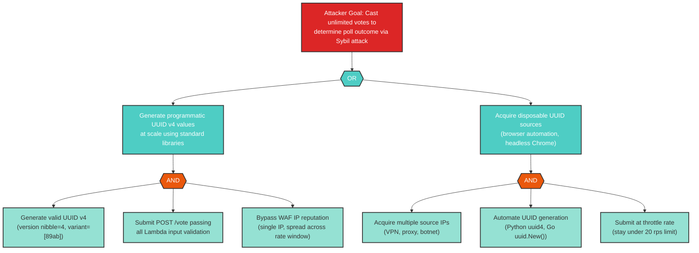

_Standalone file: `attack-trees/S-6-attack-tree.md`_

---

### T-5: Systematic Ballot-Stuffing via Multi-Identity Concurrent Vote Submission

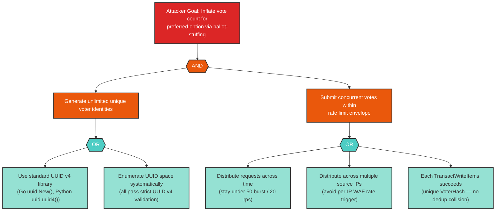

_Standalone file: `attack-trees/T-5-attack-tree.md`_

---

### E-4: Sybil Privilege Elevation Enabling Poll Outcome Determination

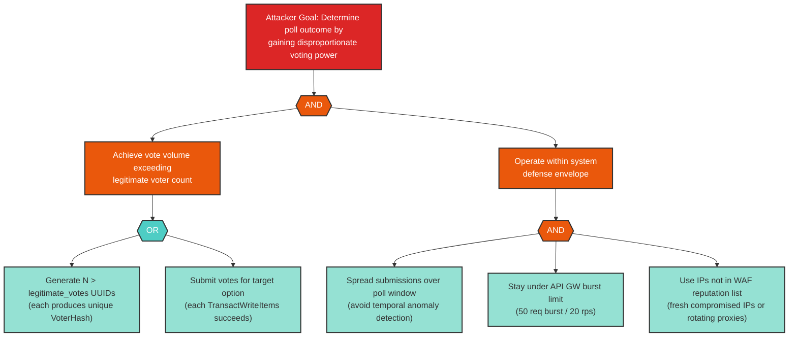

_Standalone file: `attack-trees/E-4-attack-tree.md`_

---

### S-4: Direct-to-Origin Bypass of CloudFront Security Controls

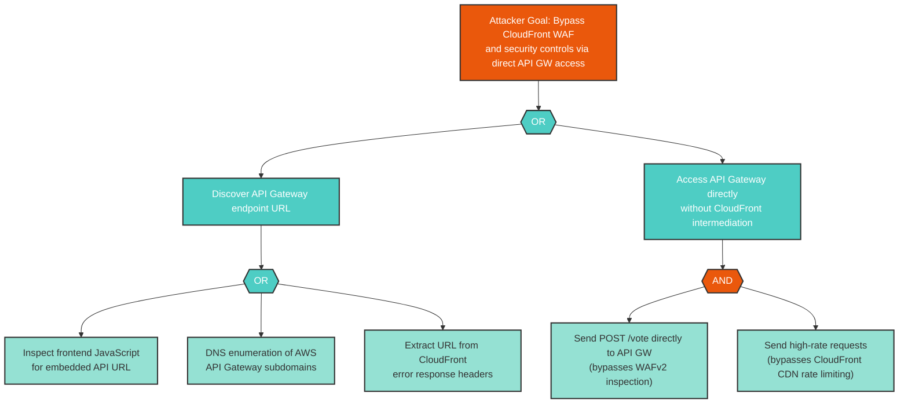

_Standalone file: `attack-trees/S-4-attack-tree.md`_

---

### T-9: AuditLog Write Suppression via Exception Swallowing

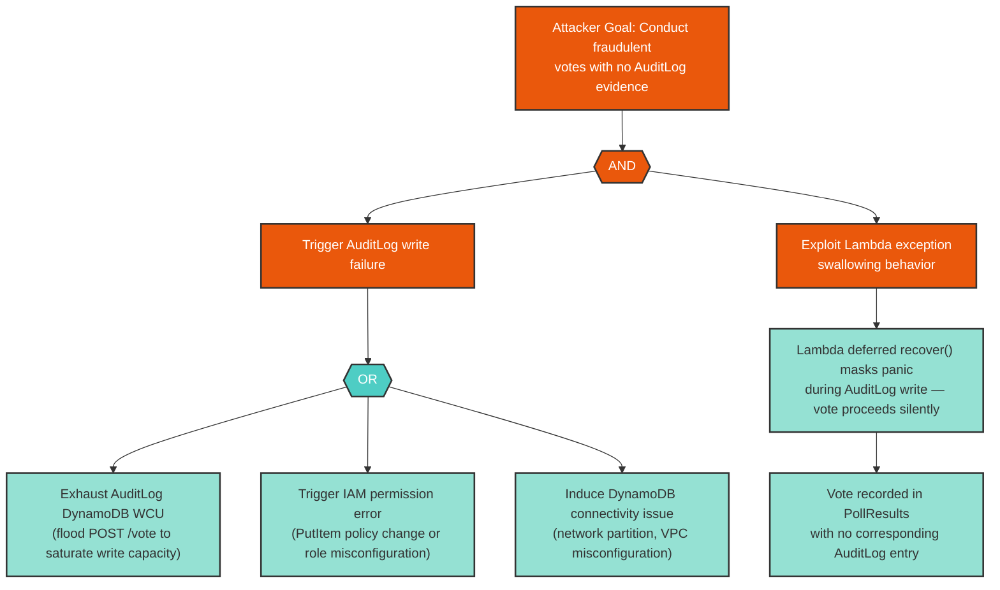

_Standalone file: `attack-trees/T-9-attack-tree.md`_

---

### I-4: API Gateway Access Logs Capture voter_id UUID Breaking GDPR Pseudonymisation

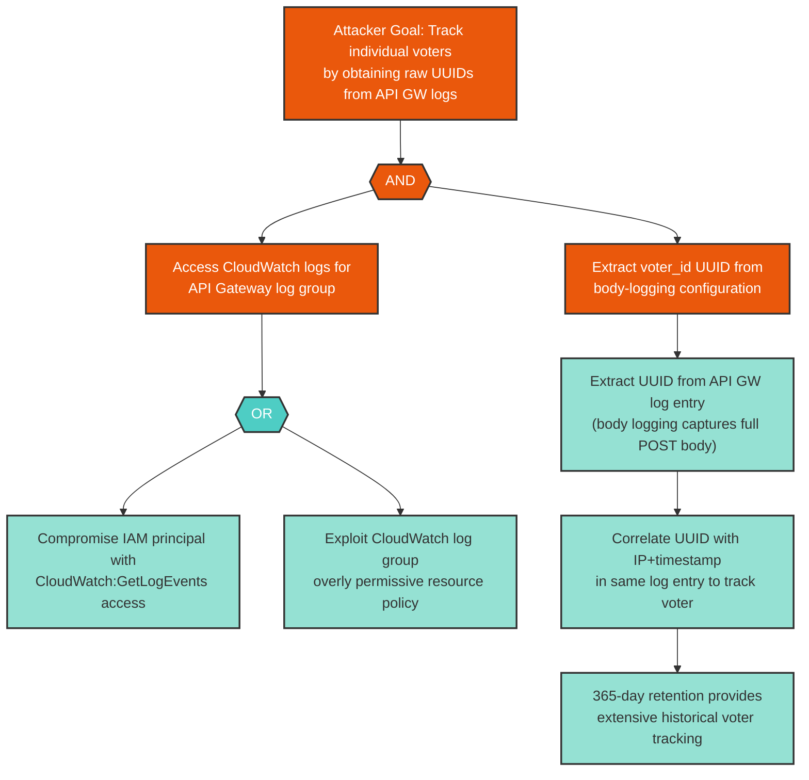

_Standalone file: `attack-trees/I-4-attack-tree.md`_

---

### I-5: Lambda Structured Log Over-Logging Exposes Raw UUIDs

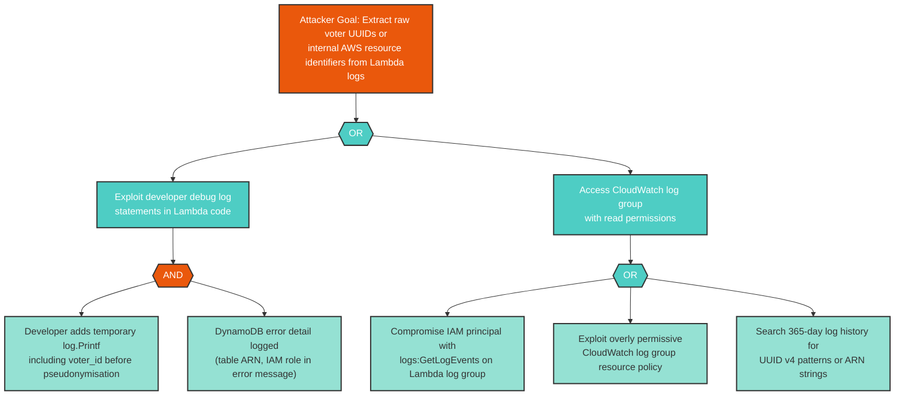

_Standalone file: `attack-trees/I-5-attack-tree.md`_

---

### D-4: API Gateway Burst Limit Exhaustion via Distributed Requests

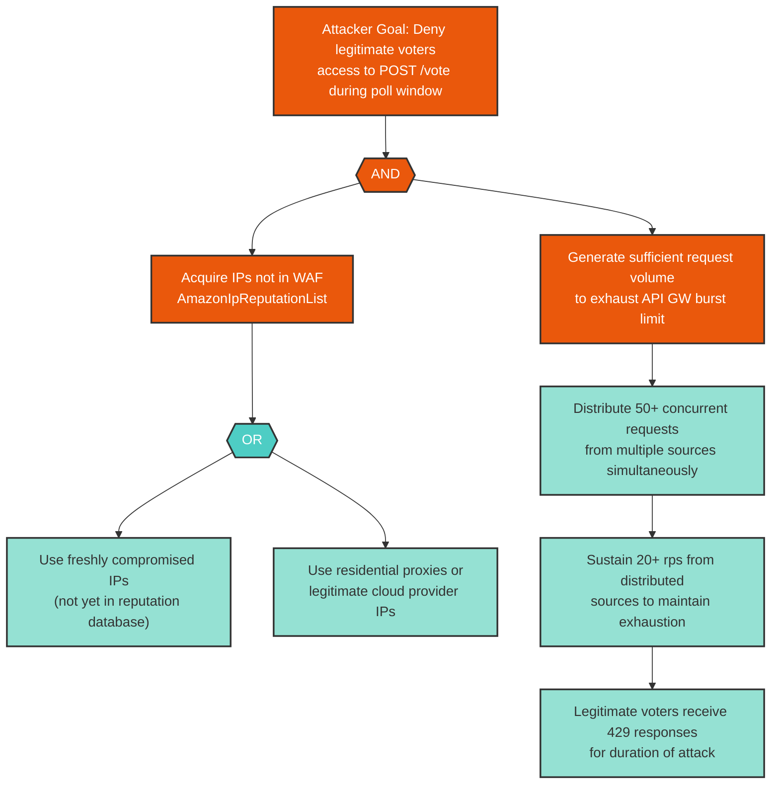

_Standalone file: `attack-trees/D-4-attack-tree.md`_

---

### D-7: DynamoDB PollResults Write Capacity Exhaustion

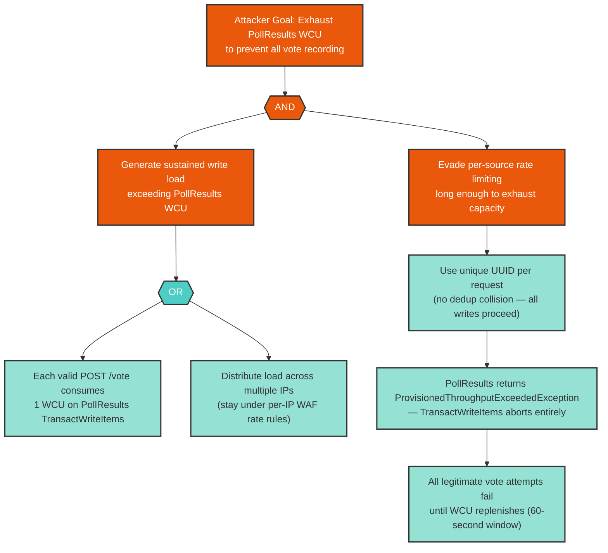

_Standalone file: `attack-trees/D-7-attack-tree.md`_

---

### D-8: VoterLog Write Saturation via Unique-UUID Flooding

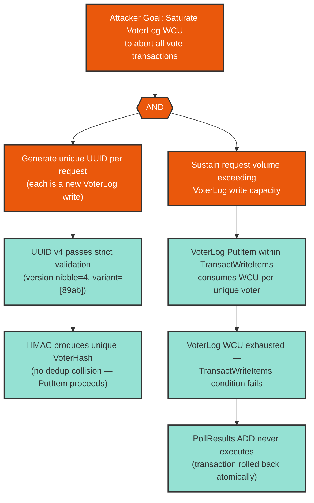

_Standalone file: `attack-trees/D-8-attack-tree.md`_

---

### D-9: AuditLog Write Failure Cascading to Vote Processing Failure

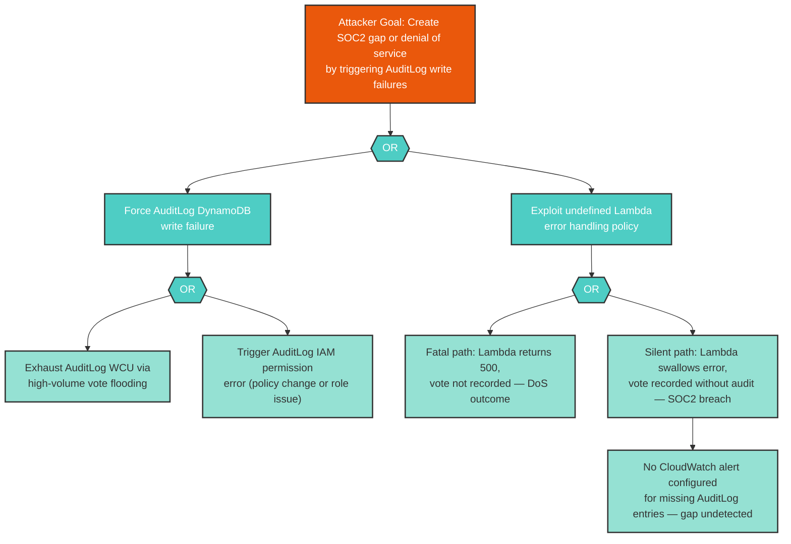

_Standalone file: `attack-trees/D-9-attack-tree.md`_

---

## 7. Remediation Roadmap

### Immediate — Critical (before production launch)

| Finding ID | Component | Mitigation | Effort | Dependencies |
|------------|-----------|------------|--------|--------------|
| S-6 | Go Lambda | Implement WAF rate-based rule on POST /vote keyed to source IP (max N requests per 5-minute window); add WAF Bot Control managed rule set; consider CAPTCHA for POST /vote; implement server-side per-IP vote anomaly alerting | High | WAFv2 configuration, Bot Control subscription |
| T-5 | Go Lambda | Implement WAF rate-based rule on POST /vote; add Bot Control; implement per-poll vote velocity anomaly detection with automated alerting; evaluate signed challenge token | High | S-6 mitigation (shared implementation) |
| E-4 | Go Lambda | Implement IP-keyed rate limiting at WAF; add Bot Control; evaluate vote velocity anomaly detection; implement CAPTCHA; add server-side Sybil detection heuristics | High | S-6 and T-5 mitigation (shared implementation) |
| T-9 | AuditLog | Define and implement explicit AuditLog failure policy (fatal — return 500, do not record vote); implement secondary CloudWatch Logs audit channel as fallback; add CloudWatch metric filter alerting on votes without AuditLog events | Medium | None |
| D-9 | AuditLog | Enable DynamoDB on-demand capacity for AuditLog; define explicit error handling policy (fatal); implement secondary audit channel (CloudWatch Logs); set CloudWatch alarm on AuditLog write failure rate | Medium | T-9 mitigation |

### Short-term — High (current development cycle)

| Finding ID | Component | Mitigation | Effort | Dependencies |
|------------|-----------|------------|--------|--------------|
| S-4 | CloudFront Distribution | Implement API Gateway resource policy restricting invocations to CloudFront IP ranges; require a secret header set by CloudFront that Lambda validates; reject requests missing the header | Medium | API Gateway and Lambda code changes |
| I-4 | API Gateway v2 HTTP API | Configure API Gateway v2 access log format in Terraform to exclude request body content; review body logging settings; implement CloudWatch log group resource policy restricting access | Low | Terraform configuration |
| I-5 | Go Lambda | Implement structured logging library with PII field filtering; establish code review checklist for log statements; implement UUID v4 pattern scanning in CI/CD log output; restrict CloudWatch log group access policy | Medium | CI/CD pipeline changes |
| D-4 | API Gateway v2 HTTP API | Enable WAF Bot Control managed rule set; implement WAF rate-based rule per source IP for POST /vote; implement DDoS escalation runbook; evaluate AWS Shield Advanced | Medium | WAFv2 configuration, Bot Control subscription |
| D-7 | PollResults | Enable DynamoDB on-demand capacity mode for PollResults; configure CloudWatch alarm on ConsumedWriteCapacityUnits; apply WAF rate-based rules on POST /vote | Low | Terraform DynamoDB configuration |
| D-8 | VoterLog | Enable DynamoDB on-demand capacity mode for VoterLog; implement WAF rate-based rules; configure CloudWatch alarm on VoterLog WCU; implement Lambda circuit breaker for sustained DynamoDB write failures | Low | Terraform DynamoDB configuration |

### Medium-term — Medium (upcoming planning cycle)

| Finding ID | Component | Mitigation | Effort | Dependencies |
|------------|-----------|------------|--------|--------------|
| S-1 | User Browser | Strengthen CSP; implement SRI on all frontend assets; evaluate server-side session token supplement | Low | Frontend configuration |
| S-3 | WAFv2 WebACL | Enable full WAF logging; subscribe to AWS Managed Rules notifications; implement rate-based rules as defense-in-depth | Low | WAFv2 configuration |
| T-2 | CloudFront Distribution | Enable AWS Config rule for S3 bucket policy changes; implement S3 Object Lock in governance mode; enable CloudTrail for S3 data events | Low | AWS Config setup |
| T-3 | S3 Frontend Bucket | Migrate CI/CD to OIDC-based IAM roles; enable S3 MFA Delete; implement deployment approval gates | Medium | CI/CD pipeline migration |
| T-4 | API Gateway v2 HTTP API | Implement Terraform state drift detection in CI/CD; configure AWS Config custom rules for throttle validation | Low | CI/CD pipeline changes |
| T-6 | Secrets Manager | Define and document salt rotation policy; implement VoterLog hash migration procedure; add salt version field to VoterHash | High | Architecture change (VoterHash versioning) |
| T-7 | PollResults | Add DynamoDB condition expressions enforcing ADD-only semantics; audit Go dependencies; enable CloudTrail data events for PollResults | Low | Lambda code change |
| R-2 | WAFv2 WebACL | Enable full WAF logging to S3/Kinesis; implement 365-day log retention; create CloudWatch WAF block event dashboards | Low | WAFv2 configuration |
| R-4 | API Gateway v2 HTTP API | Configure API Gateway v2 access log format to include all required fields in Terraform; validate in CI/CD; document in SOC2 evidence package | Low | Terraform configuration |
| R-5 | Go Lambda | Inject API Gateway requestId as structured log field; implement structured JSON logging; test log reconstruction in staging | Medium | Lambda code change |
| I-2 | CloudFront Distribution | Configure custom CloudFront error pages for all 4xx/5xx codes; suppress AWS-default error page bodies; audit response headers | Low | CloudFront configuration |
| I-6 | Secrets Manager | Document salt compromise response procedure; implement CloudTrail alerting on anomalous GetSecretValue; disable debug endpoints in production builds | Low | Runbook creation |
| I-7 | PollResults | Implement result visibility gating (vote threshold or time-gate); add CloudFront caching for GET /results with short TTL; implement WAF rate limiting on GET /results | Medium | Lambda and CloudFront configuration |
| I-8 | VoterLog | Verify VoterLog IAM restricted to Lambda execution role only; implement CloudTrail alerting on unexpected GetSecretValue; document VoterLog invalidation procedure | Low | IAM review |
| I-9 | AuditLog | Evaluate second-level hash for ActorID; restrict AuditLog read access to audit IAM roles; include in SOC2 logical access reviews | Medium | Architecture evaluation |
| D-6 | Secrets Manager | Configure Lambda provisioned concurrency; add exponential backoff in GetSecretValue calls; implement ThrottleCount CloudWatch alarm | Low | Lambda configuration |
| E-1 | WAFv2 WebACL | Verify Lambda IMDS isolation; enforce IMDSv2 if Lambda in VPC; add Lambda network egress controls | Low | Network configuration review |
| E-3 | API Gateway v2 HTTP API | Implement Terraform change approval for API GW routes; add automated test asserting expected route set; implement Lambda authorizer as default deny | Medium | CI/CD and infrastructure controls |

### Backlog — Low and Note (future consideration)

| Finding ID | Component | Mitigation | Effort | Dependencies |
|------------|-----------|------------|--------|--------------|
| S-2 | User Browser | Replace Math.random fallback with CSPRNG polyfill; add browser capability detection | Low | None |
| S-5 | API Gateway v2 HTTP API | Configure catch-all route returning 403; review Lambda dispatcher for unexpected route handling | Low | None |
| T-1 | WAFv2 WebACL | Subscribe to AWS Security Bulletins; implement CloudWatch alarms on WAF block rate anomalies | Low | None |
| T-8 | VoterLog | Add server-side ExpiresAt validation; implement CloudWatch metric filter on TTL values; add unit tests | Low | None |
| R-1 | User Browser | Document pseudonymisation design in privacy notices; maintain CloudFront access logs | Low | None |
| R-3 | CloudFront Distribution | Accept as residual risk; supplement with API Gateway access logs; use CloudWatch Log Insights joins | Low | None |
| I-1 | WAFv2 WebACL | Accept as residual risk; ensure consistent error response timing; align WAF and origin status codes | Low | None |
| I-3 | S3 Frontend Bucket | Apply strict bucket policy on audit bucket; enable S3 Block Public Access; use S3 Object Lock | Low | None |
| D-1 | WAFv2 WebACL | Enable WAF rate-based rules to constrain evaluation volume; accept AWS-internal complexity limits | Low | None |
| D-2 | CloudFront Distribution | Configure CloudFront cache policies with minimal cache-key headers; monitor cache hit rate | Low | None |
| D-3 | S3 Frontend Bucket | Accept CloudFront caching as primary mitigation; monitor CloudFront request rates | Low | None |
| D-5 | Go Lambda | Enable Lambda provisioned concurrency for base warm instances; implement ThrottleCount alarm | Low | None |
| E-2 | CloudFront Distribution | Verify S3 bucket policy uses aws:SourceArn; run periodic Terraform plan checks; verify OAC condition | Low | None |

---

## 8. Appendix: Finding Reference

| Finding ID | Report Section | Heading Reference |
|------------|----------------|-------------------|
| S-1 | 3.1 | Spoofing |
| S-2 | 3.1 | Spoofing |
| S-3 | 3.1 | Spoofing |
| S-4 | 3.1 / 4 / 5 | Spoofing / Cross-Cutting Theme 4 / Attack Trees |
| S-5 | 3.1 | Spoofing |
| S-6 | 3.1 / 4 / 5 | Spoofing / Cross-Cutting Theme 1 / Attack Trees |
| T-1 | 3.2 | Tampering |
| T-2 | 3.2 | Tampering |
| T-3 | 3.2 | Tampering |
| T-4 | 3.2 / 4 | Tampering / Cross-Cutting Theme 4 |
| T-5 | 3.2 / 4 / 5 | Tampering / Cross-Cutting Theme 1 / Attack Trees |
| T-6 | 3.2 | Tampering |
| T-7 | 3.2 | Tampering |
| T-8 | 3.2 | Tampering |
| T-9 | 3.2 / 4 / 5 | Tampering / Cross-Cutting Theme 3 / Attack Trees |
| R-1 | 3.3 | Repudiation |
| R-2 | 3.3 | Repudiation |
| R-3 | 3.3 | Repudiation |
| R-4 | 3.3 / 4 | Repudiation / Cross-Cutting Theme 4 |
| R-5 | 3.3 | Repudiation |
| I-1 | 3.4 | Information Disclosure |
| I-2 | 3.4 | Information Disclosure |
| I-3 | 3.4 | Information Disclosure |
| I-4 | 3.4 / 4 / 5 | Information Disclosure / Cross-Cutting Theme 2 / Attack Trees |
| I-5 | 3.4 / 4 / 5 | Information Disclosure / Cross-Cutting Theme 2 / Attack Trees |
| I-6 | 3.4 / 4 | Information Disclosure / Cross-Cutting Theme 2 |
| I-7 | 3.4 | Information Disclosure |
| I-8 | 3.4 / 4 | Information Disclosure / Cross-Cutting Theme 2 |
| I-9 | 3.4 | Information Disclosure |
| D-1 | 3.5 | Denial of Service |
| D-2 | 3.5 | Denial of Service |
| D-3 | 3.5 | Denial of Service |
| D-4 | 3.5 / 4 / 5 | Denial of Service / Cross-Cutting Theme 4 / Attack Trees |
| D-5 | 3.5 | Denial of Service |
| D-6 | 3.5 | Denial of Service |
| D-7 | 3.5 / 5 | Denial of Service / Attack Trees |
| D-8 | 3.5 / 5 | Denial of Service / Attack Trees |
| D-9 | 3.5 / 4 / 5 | Denial of Service / Cross-Cutting Theme 3 / Attack Trees |
| E-1 | 3.6 | Elevation of Privilege |
| E-2 | 3.6 | Elevation of Privilege |
| E-3 | 3.6 / 4 | Elevation of Privilege / Cross-Cutting Theme 4 |
| E-4 | 3.6 / 4 / 5 | Elevation of Privilege / Cross-Cutting Theme 1 / Attack Trees |
