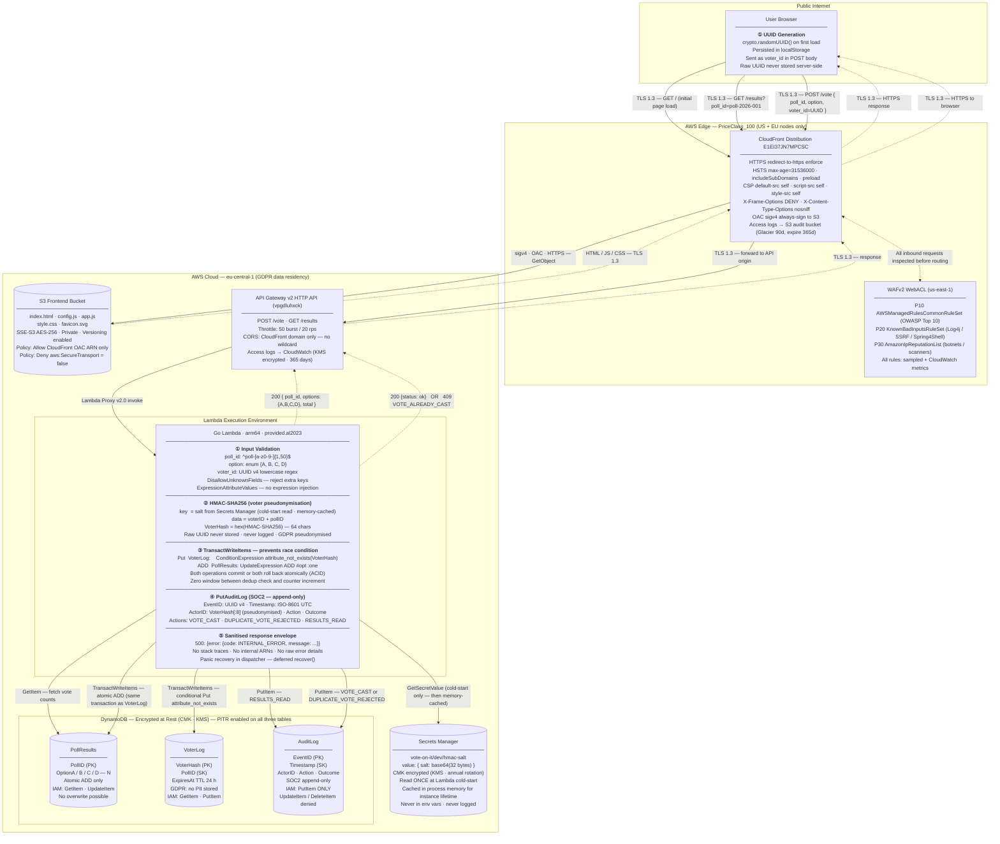

# Vote-on-It — Security Architecture

> Source of truth: `lambda/`, `frontend/`, and `terraform/` as committed on `main`.  
> Reflects live deployment: CloudFront `E1EI37JN7MPCSC` · API GW `vpgdluhxck` · Region `eu-central-1`.

---

## Data Flow Diagram

Subgraphs represent trust boundaries. Solid arrows are request paths; dashed arrows are
response paths. All paths crossing a trust boundary are labelled with their transport
security. Steps **①–⑤** inside the Lambda node are keyed to the prose below.



---

## Key Security Flow Notes

### How the UUID is pseudonymised (steps ① → ②)

The browser generates a UUID v4 (`crypto.randomUUID()` with `Math.random` fallback) on first
load and stores it in `localStorage`. This UUID is the `voter_id` in every `POST /vote`
request. On the server, Lambda immediately computes:

```
VoterHash = HMAC-SHA256( voterID + pollID,  salt )
```

where `salt` is a 32-byte random value read from AWS Secrets Manager at cold-start and held
in process memory. **The raw UUID is discarded**; only the 64-char hex hash is written to
`VoterLog`. No IP address is ever received, processed, or stored — the UUID replaces it
entirely, satisfying GDPR Article 4(5) pseudonymisation.

### How the DynamoDB transaction eliminates the race condition (step ③)

A naive two-step flow — (1) check if voter exists, (2) increment counter — has a TOCTOU race:
two concurrent requests can both pass the existence check before either writes the dedup
record, resulting in double-counting. The implementation uses a single `TransactWriteItems`
call that atomically executes both writes:

| Operation | Table | Condition |
|---|---|---|
| `Put` | `VoterLog` | `ConditionExpression: attribute_not_exists(VoterHash)` |
| `Update` | `PollResults` | `UpdateExpression: ADD #opt :one` |

DynamoDB executes these as an ACID unit. If the condition fails (voter has already voted),
the entire transaction rolls back — the counter is never incremented. There is zero window
between the dedup check and the counter write.

---

## STRIDE Threat Analysis

One primary threat per node, mapped to implemented SOC2/GDPR controls.

| Node | STRIDE | Attack Scenario | Implemented Controls |
|---|---|---|---|
| **User Browser** | **Spoofing** | Attacker steals a voter's UUID from `localStorage` (e.g., via a compromised browser extension) and replays it to cast a fraudulent vote on their behalf. | Server-side `HMAC-SHA256(voterID+pollID, salt)` with a Secrets Manager salt makes the hash unguessable without the salt. Even if the raw UUID is known, the **DynamoDB conditional Put** (`attribute_not_exists(VoterHash)`) makes replay atomically impossible — the hash was written on the first vote and the condition will permanently fail for any subsequent attempt with the same UUID+pollID pair. |
| **CloudFront + WAFv2** | **Denial of Service** | Volumetric DDoS flood or exploit burst (OWASP, Log4j, Spring4Shell) targeting the `/vote` endpoint to exhaust Lambda concurrency or DynamoDB write capacity. | WAFv2 `AmazonIpReputationList` blocks known botnet IPs at the edge before traffic reaches the origin; `AWSManagedRulesCommonRuleSet` blocks OWASP Top 10 payloads; API Gateway throttle (50 burst / 20 rps) prevents Lambda saturation; CloudFront absorbs and caches edge traffic; `reserved_concurrent_executions` (to be re-enabled for production) limits Lambda blast radius. |
| **API Gateway v2** | **Tampering** | Attacker sends a crafted JSON body containing an oversized `poll_id`, extra fields, or NoSQL-style injection strings to corrupt DynamoDB expression evaluation. | Handler calls `json.NewDecoder(...).DisallowUnknownFields()` — any extra key returns `400 INVALID_JSON`. `poll_id` is validated against `^poll-[a-z0-9-]{1,50}$`; `option` against a fixed enum; `voter_id` against a UUID v4 regex. All DynamoDB expressions use `ExpressionAttributeValues` and `ExpressionAttributeNames` — raw user input is never interpolated into expression strings. |
| **Go Lambda** | **Information Disclosure** | Unhandled exception propagates a Go stack trace containing DynamoDB table names, IAM role ARN, or internal error details to the caller, enabling reconnaissance for a follow-on attack. | Every error path returns only `{"error":{"code":"INTERNAL_ERROR","message":"An unexpected error occurred."}}`. A `defer recover()` in `dispatch()` catches panics before they reach the Lambda runtime. **Structured JSON logging** records `VoterHash[:8]` as `actor_id` — never the raw UUID, never an IP address, never internal resource identifiers. |
| **DynamoDB VoterLog + AuditLog** | **Repudiation** | A voter disputes that they voted; an insider attempts to delete AuditLog records to cover a fraudulent vote injection. | The Lambda IAM role has **`PutItem` only** on `AuditLog` — `UpdateItem` and `DeleteItem` are explicitly absent from the policy. Every vote path writes an immutable `VOTE_CAST` or `DUPLICATE_VOTE_REJECTED` record with a UUID v4 `EventID`, ISO-8601 timestamp, `VoterHash[:8]` actor, and `SUCCESS`/`FAILURE` outcome. PITR on all three tables provides point-in-time recovery against accidental or malicious table deletion. |
| **DynamoDB PollResults** | **Elevation of Privilege** | Attacker submits concurrent `POST /vote` requests with different UUIDs to artificially inflate a preferred option beyond legitimate vote counts. | `TransactWriteItems` atomically binds the dedup guard (`attribute_not_exists(VoterHash)` on `VoterLog`) and the counter increment (`ADD #opt :one` on `PollResults`) in a single ACID transaction. There is no gap between the existence check and the write — concurrent duplicates cannot both pass. Each `voter_id` hashes to a unique `VoterHash`; generating new UUIDs is rate-limited at the edge by WAF IP reputation and API Gateway throttling. |
| **Secrets Manager (HMAC salt)** | **Information Disclosure** | Attacker gains read access to the HMAC salt, enabling offline pre-computation of `VoterHash` values to enumerate which UUIDs have voted, breaking GDPR pseudonymisation. | IAM policy allows `secretsmanager:GetSecretValue` only from the Lambda execution role and only on the **exact secret ARN** (no wildcard). The secret is CMK-encrypted — accessing the raw secret store value also requires the KMS key. Lambda reads once at cold-start, caches in process memory, and **never logs, echoes, or exposes the salt value** in any response, environment variable, or CloudWatch stream. Annual CMK key rotation is enforced by Terraform. |
